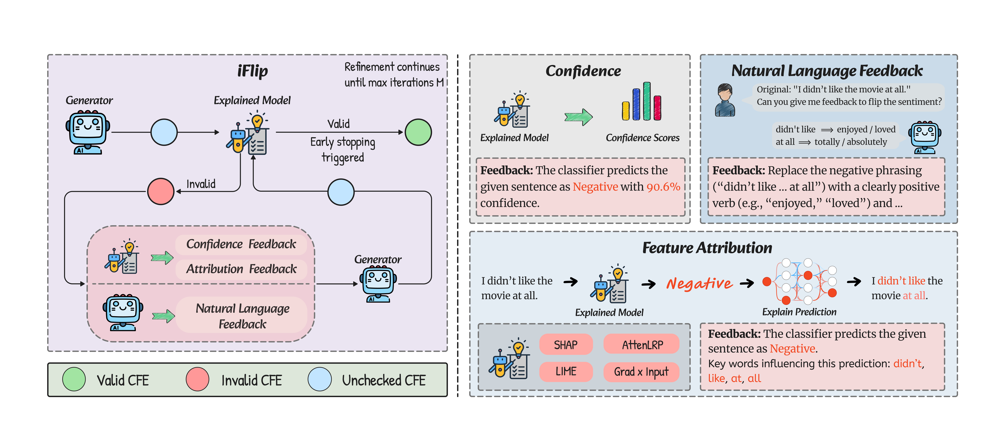

# iFlip: A Feedback-Driven Framework for Iterative Counterfactual Example Refinement

## Overview




**iFlip** is an iterative refinement framework for generating high-validity counterfactual examples that overcome the limitations of single-pass generation. The method consists of three stages involving a generator and an explained model: (1) Generation - the generator produces initial counterfactual candidates; (2) Verification - the explained model validates whether the candidate changes the prediction; (3) Refinement - if verification fails, we leverage feedback signals to refine the counterfactual candidate until the label flips. iFlip leverages three types of feedback: confidence-based feedback, feature attribution-based feedback (SHAP, AttnLRP, LIME, Gradient × Input), and natural language feedback. 


## Models and Datasets

### Explained Models

The explained models (classifiers) used for validation and feedback generation are pre-trained models from TextAttack:

| Dataset | Model | Source |
|---------|-------|--------|
| IMDb | `textattack/bert-base-uncased-imdb` | [HuggingFace](https://huggingface.co/textattack/bert-base-uncased-imdb) |
| AG News | `textattack/bert-base-uncased-ag-news` | [HuggingFace](https://huggingface.co/textattack/bert-base-uncased-ag-news) |
| SNLI | `textattack/bert-base-uncased-snli` | [HuggingFace](https://huggingface.co/textattack/bert-base-uncased-snli) |

### Generator Models

The generator models (LLMs for counterfactual generation and refinement) used in experiments:

| Model | Size | Source |
|-------|------|--------|
| OLMo-2-1124-7B-Instruct | 7B | [HuggingFace](https://huggingface.co/allenai/OLMo-2-1124-7B-Instruct) |
| Qwen/Qwen3-32B | 32B | [HuggingFace](https://huggingface.co/Qwen/Qwen3-32B) |
| Llama-3.3-70B-Instruct | 70B | [HuggingFace](https://huggingface.co/meta-llama/Llama-3.3-70B-Instruct) |

### Datasets

| Dataset | Task | Source |
|---------|------|--------|
| IMDb | Sentiment Analysis | [HuggingFace](https://huggingface.co/datasets/stanfordnlp/imdb) |
| AG News | Topic Classification | [HuggingFace](https://huggingface.co/datasets/sentence-transformers/agnews) |
| SNLI | Natural Language Inference | [HuggingFace](https://huggingface.co/datasets/stanfordnlp/snli) |


## Faithfulness Evaluation

Faithfulness evaluation using [FERRET](https://github.com/g8a9/ferret) with additional support for **AttnLRP** explainer alongside existing SHAP, LIME, and gradient-based methods.

## Setup

```bash
pip install -r requirements.txt
```


## Usage

### Single Job

Run counterfactual generation using a specific method on a chosen dataset:

```bash
python -m iflip.generation \
    --method {lxt,shap,conf,lime,gradxinput,nl} \
    --dataset {imdb,snli,agnews} \
    --max_refinement_rounds 5 \
    --max_base_attempts 3 \
    --output_file counterfactuals_iflip.csv \
    --early_stop
    --edit_target {premise,hypothesis} \
```


#### Command Line Arguments

- `--method` (required): Feedback method to use
- `--dataset` (required): Dataset name (imdb, snli, agnews)
- `--max_refinement_rounds` (default: 5): Maximum refinement iterations
- `--max_base_attempts` (default: 3): Maximum initial generation attempts
- `--output_file` (default: counterfactuals.csv): Output file path
- `--early_stop`: Enable early stopping on successful label flip
- `--edit_target` (SNLI only): Which part to edit (premise/hypothesis)


#### Available Methods

| Method | Description |
|--------|-------------|
| `conf` | Confidence-based feedback|
| `shap` | SHAP-based feedback |
| `lxt` | AttnLRP-based feedback |
| `lime` | LIME-based feedback |
| `gradxinput` | Gradient×Input-based feedback |
| `nl` | Natural language feedback|


### Batch Processing

Run multiple jobs in batch using the provided script:

```bash
python scripts/generate_all.py
```

Edit `JOBS` list in `scripts/generate_all.py` to customize which method-dataset combinations to run. Job execution times are logged to `job_times.txt`.

